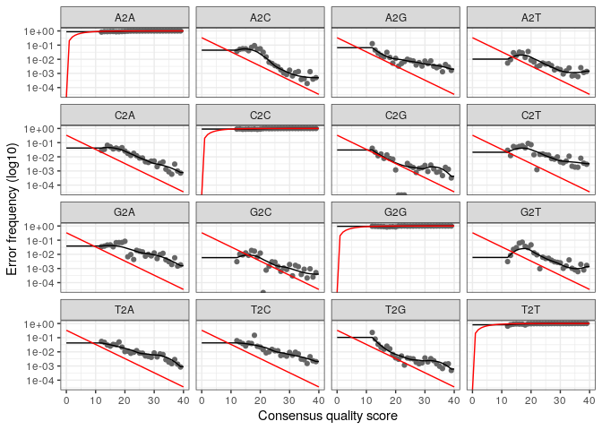
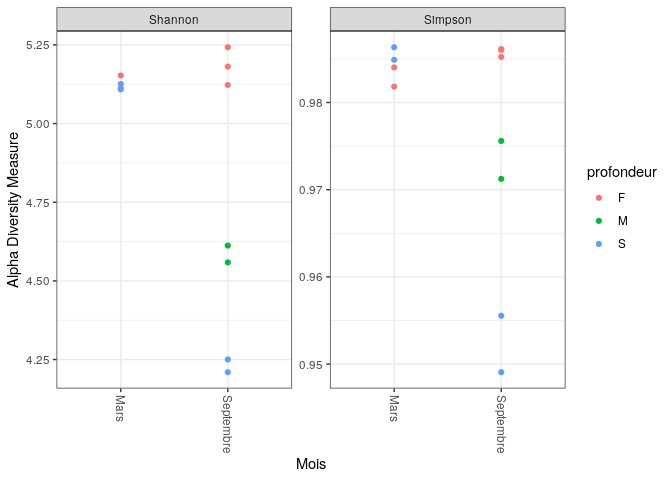
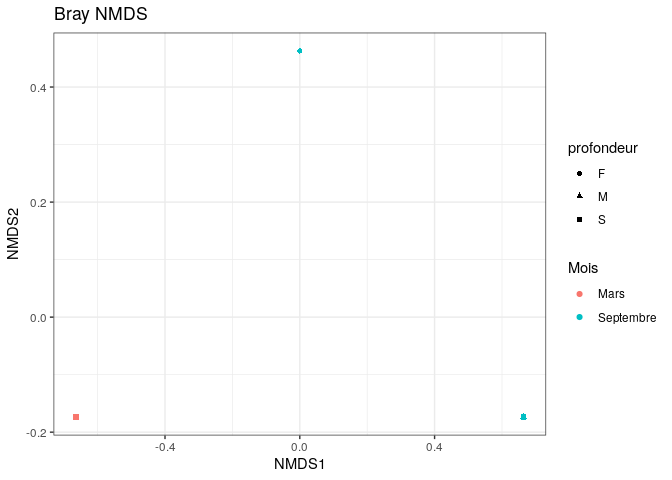
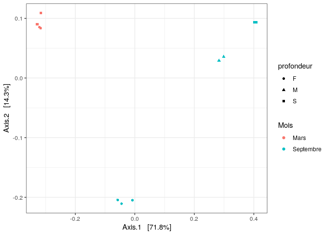
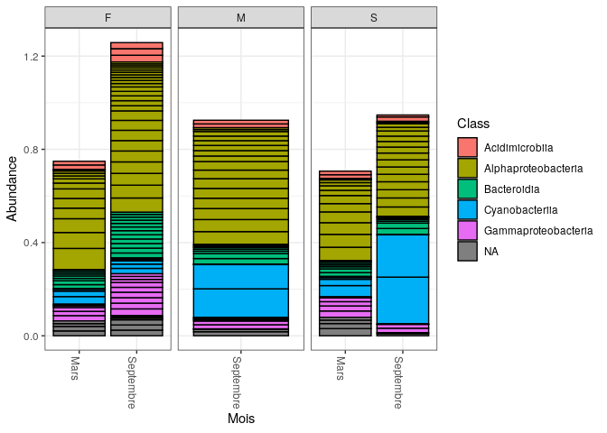
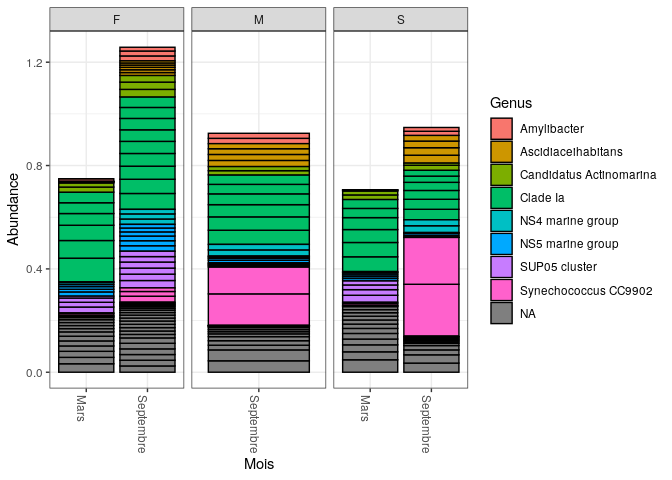
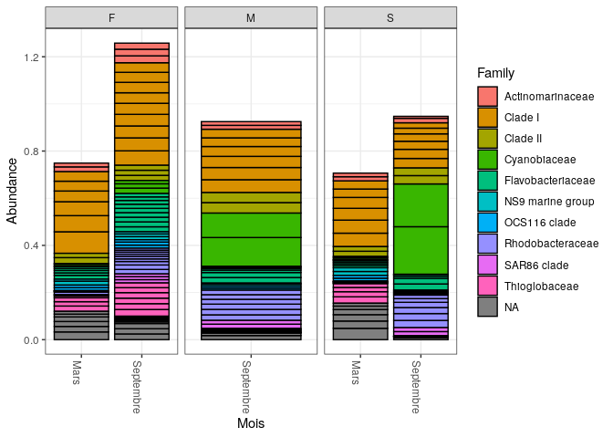

CC2
================

``` r
library(dada2) 
```

    ## Loading required package: Rcpp

``` r
library(phyloseq)
library(DECIPHER) 
```

    ## Loading required package: Biostrings

    ## Loading required package: BiocGenerics

    ## 
    ## Attaching package: 'BiocGenerics'

    ## The following objects are masked from 'package:stats':
    ## 
    ##     IQR, mad, sd, var, xtabs

    ## The following objects are masked from 'package:base':
    ## 
    ##     anyDuplicated, append, as.data.frame, basename, cbind, colnames,
    ##     dirname, do.call, duplicated, eval, evalq, Filter, Find, get, grep,
    ##     grepl, intersect, is.unsorted, lapply, Map, mapply, match, mget,
    ##     order, paste, pmax, pmax.int, pmin, pmin.int, Position, rank,
    ##     rbind, Reduce, rownames, sapply, setdiff, sort, table, tapply,
    ##     union, unique, unsplit, which.max, which.min

    ## Loading required package: S4Vectors

    ## Loading required package: stats4

    ## 
    ## Attaching package: 'S4Vectors'

    ## The following objects are masked from 'package:base':
    ## 
    ##     expand.grid, I, unname

    ## Loading required package: IRanges

    ## 
    ## Attaching package: 'IRanges'

    ## The following object is masked from 'package:phyloseq':
    ## 
    ##     distance

    ## Loading required package: XVector

    ## Loading required package: GenomeInfoDb

    ## 
    ## Attaching package: 'Biostrings'

    ## The following object is masked from 'package:base':
    ## 
    ##     strsplit

    ## Loading required package: RSQLite

    ## Loading required package: parallel

``` r
library(phangorn) 
```

    ## Loading required package: ape

    ## 
    ## Attaching package: 'ape'

    ## The following object is masked from 'package:Biostrings':
    ## 
    ##     complement

``` r
library(ggplot2) 
library(gridExtra)
```

    ## 
    ## Attaching package: 'gridExtra'

    ## The following object is masked from 'package:BiocGenerics':
    ## 
    ##     combine

``` r
library(shiny)
library(miniUI)
library(caret)
```

    ## Loading required package: lattice

``` r
library(pls)
```

    ## 
    ## Attaching package: 'pls'

    ## The following object is masked from 'package:caret':
    ## 
    ##     R2

    ## The following object is masked from 'package:ape':
    ## 
    ##     mvr

    ## The following object is masked from 'package:stats':
    ## 
    ##     loadings

``` r
library(e1071)
library(ggplot2)
library(randomForest)
```

    ## randomForest 4.7-1.1

    ## Type rfNews() to see new features/changes/bug fixes.

    ## 
    ## Attaching package: 'randomForest'

    ## The following object is masked from 'package:gridExtra':
    ## 
    ##     combine

    ## The following object is masked from 'package:ggplot2':
    ## 
    ##     margin

    ## The following object is masked from 'package:BiocGenerics':
    ## 
    ##     combine

``` r
library(dplyr)
```

    ## 
    ## Attaching package: 'dplyr'

    ## The following object is masked from 'package:randomForest':
    ## 
    ##     combine

    ## The following object is masked from 'package:gridExtra':
    ## 
    ##     combine

    ## The following objects are masked from 'package:Biostrings':
    ## 
    ##     collapse, intersect, setdiff, setequal, union

    ## The following object is masked from 'package:GenomeInfoDb':
    ## 
    ##     intersect

    ## The following object is masked from 'package:XVector':
    ## 
    ##     slice

    ## The following objects are masked from 'package:IRanges':
    ## 
    ##     collapse, desc, intersect, setdiff, slice, union

    ## The following objects are masked from 'package:S4Vectors':
    ## 
    ##     first, intersect, rename, setdiff, setequal, union

    ## The following objects are masked from 'package:BiocGenerics':
    ## 
    ##     combine, intersect, setdiff, union

    ## The following objects are masked from 'package:stats':
    ## 
    ##     filter, lag

    ## The following objects are masked from 'package:base':
    ## 
    ##     intersect, setdiff, setequal, union

``` r
library(ggrepel)
#library(nlme)
library(devtools)
```

    ## Loading required package: usethis

``` r
library(reshape2)
library(PMA)
#library(structSSI)
library(ade4)
```

    ## 
    ## Attaching package: 'ade4'

    ## The following object is masked from 'package:Biostrings':
    ## 
    ##     score

    ## The following object is masked from 'package:BiocGenerics':
    ## 
    ##     score

``` r
library(ggnetwork)
library(intergraph)
library(scales)
library(phyloseqGraphTest)
library(genefilter)
library(impute)
library(phyloseq); packageVersion("phyloseq")
```

    ## [1] '1.40.0'

``` r
library(Biostrings); packageVersion("Biostrings")
```

    ## [1] '2.64.1'

``` r
library(ggplot2); packageVersion("ggplot2")
```

    ## [1] '3.3.6'

``` r
theme_set(theme_bw())
```

``` bash
#wget pagesperso.univ-brest.fr/~maignien/teaching/M1-MFA/UE-Ecogenomique2/EcoG2_data_cc2.tar.gz
# x=désarchive z dézip v verbose f file
#tar xzvf EcoG2_data_cc2.tar.gz
```

``` bash
cp St_Stratif_10sept14/* data
cp St_Stratif_11mars15/* data
```

``` r
septembre <- "/home/rstudio/CC2/St_Stratif_10sept14"
mars <- "/home/rstudio/CC2/St_Stratif_11mars15"
path <- "/home/rstudio/CC2/data"
```

``` r
# séparer data en R1 R2
fnFs <- sort(list.files(path, pattern="_R1.fastq", full.names = TRUE))
fnRs <- sort(list.files(path, pattern="_R2.fastq", full.names = TRUE))
sample.names <- sapply(strsplit(basename(fnFs), "_R"), `[`, 1)
```

# séparer septembre en R1 R2

fnFs_s \<- sort(list.files(septembre, pattern=“\_R1.fastq”, full.names =
TRUE)) fnRs_s \<- sort(list.files(septembre, pattern=“*R2.fastq”,
full.names = TRUE)) sample.names_s \<- sapply(strsplit(basename(fnFs_s),
”*”), `[`, 1) \# séparer mars en R1 R2 fnFs_m \<- sort(list.files(mars,
pattern=“\_R1.fastq”, full.names = TRUE)) fnRs_m \<-
sort(list.files(mars, pattern=“*R2.fastq”, full.names = TRUE))
sample.names_m \<- sapply(strsplit(basename(fnFs_m), ”*”), `[`, 1)

``` r
plotQualityProfile(fnFs[1:2])
```

    ## Warning: `guides(<scale> = FALSE)` is deprecated. Please use `guides(<scale> =
    ## "none")` instead.

<!-- -->

``` r
plotQualityProfile(fnRs[1:2])
```

    ## Warning: `guides(<scale> = FALSE)` is deprecated. Please use `guides(<scale> =
    ## "none")` instead.

<!-- -->

``` r
# Place filtered files in filtered/ subdirectory
filtFs <- file.path(path, "filtered", paste0(sample.names, "_F_filt.fastq.gz"))
filtRs <- file.path(path, "filtered", paste0(sample.names, "_R_filt.fastq.gz"))
names(filtFs) <- sample.names
names(filtRs) <- sample.names
```

``` r
# zone amplifiée 450 pb -> 246 + 240 = 486
# filtrer amorces font 18 pb
# 486 - (2x18) = 450 (c'est juste mais avec la qualité des R2 pas le choix)
out <- filterAndTrim(fnFs, filtFs, fnRs, filtRs, trimLeft = c(18, 18), truncLen =c(246,240), maxN=0, maxEE=c(2,2), truncQ=2, rm.phix = TRUE, compress=TRUE, multithread=FALSE)
head(out)
```

    ##                                    reads.in reads.out
    ## Station5_Fond1_10sept14_R1.fastq     159971    134359
    ## Station5_Fond1_11mars15_R1.fastq     175993    148986
    ## Station5_Fond2_10sept14_R1.fastq     197039    163047
    ## Station5_Fond2_11mars15_R1.fastq      87585     74277
    ## Station5_Fond3_10sept14_R1.fastq     117140     98224
    ## Station5_Median1_10sept14_R1.fastq   116519     99475

``` r
errF <- learnErrors(filtFs, multithread=TRUE)
```

    ## 101777376 total bases in 446392 reads from 3 samples will be used for learning the error rates.

``` r
errR <- learnErrors(filtRs, multithread=TRUE)
```

    ## 115588518 total bases in 520669 reads from 4 samples will be used for learning the error rates.

``` r
plotErrors(errF, nominalQ=TRUE)
```

    ## Warning: Transformation introduced infinite values in continuous y-axis
    ## Transformation introduced infinite values in continuous y-axis

<!-- -->

``` r
# Sample Inference
dadaFs <- dada(filtFs, err=errF, multithread=TRUE)
```

    ## Sample 1 - 134359 reads in 34720 unique sequences.
    ## Sample 2 - 148986 reads in 32759 unique sequences.
    ## Sample 3 - 163047 reads in 43184 unique sequences.
    ## Sample 4 - 74277 reads in 18706 unique sequences.
    ## Sample 5 - 98224 reads in 27863 unique sequences.
    ## Sample 6 - 99475 reads in 26466 unique sequences.
    ## Sample 7 - 92142 reads in 23721 unique sequences.
    ## Sample 8 - 100666 reads in 24689 unique sequences.
    ## Sample 9 - 65857 reads in 16533 unique sequences.
    ## Sample 10 - 72414 reads in 18392 unique sequences.
    ## Sample 11 - 84743 reads in 22657 unique sequences.

``` r
dadaRs <- dada(filtRs, err=errR, multithread=TRUE)
```

    ## Sample 1 - 134359 reads in 56015 unique sequences.
    ## Sample 2 - 148986 reads in 52867 unique sequences.
    ## Sample 3 - 163047 reads in 67849 unique sequences.
    ## Sample 4 - 74277 reads in 29200 unique sequences.
    ## Sample 5 - 98224 reads in 42523 unique sequences.
    ## Sample 6 - 99475 reads in 39810 unique sequences.
    ## Sample 7 - 92142 reads in 36484 unique sequences.
    ## Sample 8 - 100666 reads in 37302 unique sequences.
    ## Sample 9 - 65857 reads in 26898 unique sequences.
    ## Sample 10 - 72414 reads in 27720 unique sequences.
    ## Sample 11 - 84743 reads in 35652 unique sequences.

``` r
dadaFs[[1]]
```

    ## dada-class: object describing DADA2 denoising results
    ## 996 sequence variants were inferred from 34720 input unique sequences.
    ## Key parameters: OMEGA_A = 1e-40, OMEGA_C = 1e-40, BAND_SIZE = 16

``` r
#Merged paired reads
mergers <- mergePairs(dadaFs, filtFs, dadaRs, filtRs, verbose=TRUE)
```

    ## 105481 paired-reads (in 3356 unique pairings) successfully merged out of 127314 (in 16565 pairings) input.

    ## 125532 paired-reads (in 2710 unique pairings) successfully merged out of 143385 (in 12587 pairings) input.

    ## 127526 paired-reads (in 4607 unique pairings) successfully merged out of 154969 (in 21304 pairings) input.

    ## 60039 paired-reads (in 1606 unique pairings) successfully merged out of 70610 (in 7555 pairings) input.

    ## 75081 paired-reads (in 2259 unique pairings) successfully merged out of 92215 (in 12438 pairings) input.

    ## 78917 paired-reads (in 2392 unique pairings) successfully merged out of 94855 (in 11302 pairings) input.

    ## 74032 paired-reads (in 1868 unique pairings) successfully merged out of 87670 (in 9597 pairings) input.

    ## 82416 paired-reads (in 2191 unique pairings) successfully merged out of 96573 (in 9880 pairings) input.

    ## 53342 paired-reads (in 1172 unique pairings) successfully merged out of 62204 (in 6004 pairings) input.

    ## 60156 paired-reads (in 1293 unique pairings) successfully merged out of 69598 (in 6546 pairings) input.

    ## 66113 paired-reads (in 1836 unique pairings) successfully merged out of 80208 (in 9437 pairings) input.

``` r
# Inspect the merger data.frame from the first sample
head(mergers[[1]])
```

    ##                                                                                                                                                                                                                                                                                                                                                                                         sequence
    ## 1        TAATACGAAGGGACCTAGCGTAGTTCGGAATTACTGGGCTTAAAGAGTTCGTAGGTGGTTGAAAAAGTTAGTGGTGAAATCCCAGAGCTTAACTCTGGAACTGCCATTAAAACTTTTCAGCTAGAGTATGATAGAGGAAAGCAGAATTTCTAGTGTAGAGGTGAAATTCGTAGATATTAGAAAGAATACCAATTGCGAAGGCAGCTTTCTGGATCATTACTGACACTGAGGAACGAAAGCATGGGTAGCGAAGAGGATTAGATACCCTCGTAGTCCATGCCGTAAACGATGTGTGTTAGACGTTGGAAATTTATTTTCAGTGTCGCAGGGAAACCGATAAACACACCGCCTGGGGAGTACGACCGCAAGGTTAAA
    ## 2        TAATACGAAGGGACCTAGCGTAGTTCGGAATTACTGGGCTTAAAGAGTTCGTAGGTGGTTGAAAAAGTTGGTGGTGAAATCCCAGAGCTTAACTCTGGAACTGCCATCAAAACTTTTCAGCTAGAGTATGATAGAGGAAAGCAGAATTTCTAGTGTAGAGGTGAAATTCGTAGATATTAGAAAGAATACCAATTGCGAAGGCAGCTTTCTGGATCATTACTGACACTGAGGAACGAAAGCATGGGTAGCGAAGAGGATTAGATACCCTCGTAGTCCATGCCGTAAACGATGTGTGTTAGACGTTGGAAATTTATTTTCAGTGTCGCAGCGAAAGCGATAAACACACCGCCTGGGGAGTACGACCGCAAGGTTAAA
    ## 3        TAATACGAAGGGACCTAGCGTAGTTCGGAATTACTGGGCTTAAAGAGTTCGTAGGTGGTTGAAAAAGTTGGTGGTGAAATCCCAGAGCTTAACTCTGGAACTGCCATCAAAACTTTTCAGCTAGAGTTTGATAGAGGAAAGCAGAATTTCTAGTGTAGAGGTGAAATTCGTAGATATTAGAAAGAATACCAATTGCGAAGGCAGCTTTCTGGATCATTACTGACACTGAGGAACGAAAGCATGGGTAGCGAAGAGGATTAGATACCCTCGTAGTCCATGCCGTAAACGATGTGTGTTAGACGTTGGAAATTTATTTTCAGTGTCGCAGCGAAAGCGATAAACACACCGCCTGGGGAGTACGACCGCAAGGTTAAA
    ## 4        TAATACGAAGGGACCTAGCGTAGTTCGGAATTACTGGGCTTAAAGAGTTCGTAGGTGGTTGAAAAAGTTAGTGGTGAAATCCCAGAGCTTAACTCTGGAACTGCCATTAAAACTTTTCAGCTAGAGTATGATAGAGGAAAGCAGAATTTCTAGTGTAGAGGTGAAATTCGTAGATATTAGAAAGAATACCAATTGCGAAGGCAGCTTTCTGGATCATTACTGACACTGAGGAACGAAAGCATGGGTAGCGAAGAGGATTAGATACCCTCGTAGTCCATGCCGTAAACGATGTGTGTTAGACGTTGGAAATTTATTTTCAGTGTCGCAGCGAAAGCGATAAACACACCGCCTGGGGAGTACGACCGCAAGGTTAAA
    ## 5        TAATACGAAGGGACCTAGCGTAGTTCGGAATTACTGGGCTTAAAGAGTTCGTAGGTGGTTGAAAAAGTTGGTGGTGAAATCCCAGAGCTTAACTCTGGAACTGCCATCAAAACTTTTCAGCTAGAGTATGATAGAGGAAAGCAGAATTTCTAGTGTAGAGGTGAAATTCGTAGATATTAGAAAGAATACCAATTGCGAAGGCAGCTTTCTGGATCATTACTGACACTGAGGAACGAAAGCATGGGTAGCGAAGAGGATTAGATACCCTCGTAGTCCATGCCGTAAACGATGTGTGTTAGACGTTGGAAATTTATTTTCAGTGTCGCAGGGAAACCGATAAACACACCGCCTGGGGAGTACGACCGCAAGGTTAAA
    ## 6 TAATACATAGGGGTCAAGCGTTGTCCGGATTTATTGGGCGTAAAGAGCTCGTAGGCGGTTCAACAAGTCGGTCGTAAAAGTTTAGGGCTCAACCCTAAAATGTCGATCGATACTGTTGTGACTAGGATACGGTAGAGGTGAATGGAATTCCGAGTGTAGCGGTGAAATGCGTAGATATTCGGAGGAACACCAATTGCGAAGGCAGTTCACTGGACCGTGATCGACGCTGAGGAGCGAAAGCTAGGGGAGCAAACAGGATTAGATACCCTGGTAGTCCTAGCTGTAAACGATGGATACTAGATGTAGGAACTGGATTGACGGTTTCTGTATCGTAGCTAACGCGTTAAGTATCCCGCCTGGGGAGTACGGTCGCAAGACTAAA
    ##   abundance forward reverse nmatch nmismatch nindel prefer accept
    ## 1      4973       1       2     75         0      0      1   TRUE
    ## 2      3980       2       1     75         0      0      2   TRUE
    ## 3      3625       3       1     75         0      0      2   TRUE
    ## 4      2396       1       1     75         0      0      2   TRUE
    ## 5      2165       2       2     75         0      0      2   TRUE
    ## 6      2100       9       4     68         0      0      1   TRUE

``` r
#Construct sequence table
seqtab <- makeSequenceTable(mergers)
dim(seqtab)
```

    ## [1]    11 12765

``` r
# Inspect distribution of sequence lengths
table(nchar(getSequences(seqtab)))
```

    ## 
    ##  358  359  369  370  371  372  373  374  375  376  377  378  379  380  381  382 
    ##    1    1    1    4  133   19  105  111 3605 1879 1544 1788 2077   72 1337   65 
    ##  383  384  388  392  393  395  398  403  404  412  429  430  431  432 
    ##    5    1    1    2    1    1    3    1    1    1    1    3    1    1

``` r
#Remove chimeras
seqtab.nochim <- removeBimeraDenovo(seqtab, method="consensus", multithread=TRUE, verbose=TRUE)
```

    ## Identified 11379 bimeras out of 12765 input sequences.

``` r
dim(seqtab.nochim)
```

    ## [1]   11 1386

``` r
sum(seqtab.nochim)/sum(seqtab)
```

    ## [1] 0.7958333

``` r
#Track reads through the pipeline
getN <- function(x) sum(getUniques(x))
track <- cbind(out, sapply(dadaFs, getN), sapply(dadaRs, getN), sapply(mergers, getN), rowSums(seqtab.nochim))
# If processing a single sample, remove the sapply calls: e.g. replace sapply(dadaFs, getN) with getN(dadaFs)
colnames(track) <- c("input", "filtered", "denoisedF", "denoisedR", "merged", "nonchim")
rownames(track) <- sample.names
head(track)
```

    ##                            input filtered denoisedF denoisedR merged nonchim
    ## Station5_Fond1_10sept14   159971   134359    131529    129778 105481   80948
    ## Station5_Fond1_11mars15   175993   148986    146302    145658 125532  102727
    ## Station5_Fond2_10sept14   197039   163047    159350    158248 127526   95564
    ## Station5_Fond2_11mars15    87585    74277     72741     71862  60039   50218
    ## Station5_Fond3_10sept14   117140    98224     95645     94415  75081   59228
    ## Station5_Median1_10sept14 116519    99475     97476     96627  78917   61395

``` bash
#données pour taxonomie
#wget zenodo.org/record/4587955/files/silva_nr99_v138.1_train_set.fa.gz
```

``` r
#Assign taxonomy
taxa <- assignTaxonomy(seqtab.nochim, "~/CC2/silva_nr99_v138.1_train_set.fa.gz", multithread=TRUE)
```

``` r
taxa.print <- taxa # Removing sequence rownames for display only
rownames(taxa.print) <- NULL
head(taxa.print)
```

    ##      Kingdom    Phylum             Class                 Order            
    ## [1,] "Bacteria" "Proteobacteria"   "Alphaproteobacteria" "SAR11 clade"    
    ## [2,] "Bacteria" "Cyanobacteria"    "Cyanobacteriia"      "Synechococcales"
    ## [3,] "Bacteria" "Proteobacteria"   "Alphaproteobacteria" "SAR11 clade"    
    ## [4,] "Bacteria" "Proteobacteria"   "Alphaproteobacteria" "SAR11 clade"    
    ## [5,] "Bacteria" "Proteobacteria"   "Alphaproteobacteria" "SAR11 clade"    
    ## [6,] "Bacteria" "Actinobacteriota" "Acidimicrobiia"      "Actinomarinales"
    ##      Family             Genus                    
    ## [1,] "Clade I"          "Clade Ia"               
    ## [2,] "Cyanobiaceae"     "Synechococcus CC9902"   
    ## [3,] "Clade I"          "Clade Ia"               
    ## [4,] "Clade I"          "Clade Ia"               
    ## [5,] "Clade II"         NA                       
    ## [6,] "Actinomarinaceae" "Candidatus Actinomarina"

``` r
# Go phyloseq
samples.out <- rownames(seqtab.nochim)
profondeur <- sapply(strsplit(samples.out, "_"), `[`, 2)
s_prof <- substr(profondeur,1,1)
day <- as.character(sapply(strsplit(samples.out, "_"), `[`, 3))
samdf <- data.frame(profondeur=s_prof, Day=day)
#Divise en mois
samdf$Mois <- "Septembre"
samdf$Mois[samdf$Day > "10sept14"] <- "Mars"
rownames(samdf) <- samples.out
```

``` r
ps <- phyloseq(otu_table(seqtab.nochim, taxa_are_rows=FALSE), 
               sample_data(samdf), 
               tax_table(taxa))
# objet phyloseq, ps@otu_table: table avec les séquences et combien de fois dans l'échantillon, sampledate: table avec échantillons, age, ID.. Tree (arbre phylo avec tous les ARN16S), Tax table: plyla classe genre..
#vérifier bonne structure bonne valeur
test<-data.frame(ps@otu_table)
test2<-ps@sam_data
test3<-data.frame(ps@tax_table)
```

``` r
dna <- Biostrings::DNAStringSet(taxa_names(ps))
names(dna) <- taxa_names(ps)
ps <- merge_phyloseq(ps, dna)
taxa_names(ps) <- paste0("ASV", seq(ntaxa(ps)))
ps
```

    ## phyloseq-class experiment-level object
    ## otu_table()   OTU Table:         [ 1386 taxa and 11 samples ]
    ## sample_data() Sample Data:       [ 11 samples by 3 sample variables ]
    ## tax_table()   Taxonomy Table:    [ 1386 taxa by 6 taxonomic ranks ]
    ## refseq()      DNAStringSet:      [ 1386 reference sequences ]

``` r
plot_richness(ps, x="Mois", measures=c("Shannon", "Simpson"), color="profondeur")
```

<!-- -->

Shannon: Les échantillons du mois de Mars ont des indices de Shannon
équivalents. On remarque que pour les échantillons de Septembre en
Surface ont un indice de Shannon plus bas, ce qui veut dire que la
répartition est plus biaisée, moins uniforme, on a peut-être une grande
proportion de cyanobactéries (photosynthétiques à la surface) ? Simpson:
La diversité est inférieure en surface pour le mois de septembre et
maximale pour l’échantillon de septembre au fond. Pour le mois de Mars,
plus de diversité pour les échantillons de Surface.

``` r
ps.prop <- transform_sample_counts(ps, function(otu) otu/sum(otu))
ord.nmds.bray <- ordinate(ps, method="NMDS", distance= "bray")
```

    ## Square root transformation
    ## Wisconsin double standardization
    ## Run 0 stress 9.916161e-05 
    ## Run 1 stress 9.919702e-05 
    ## ... Procrustes: rmse 0.00484779  max resid 0.006824748 
    ## ... Similar to previous best
    ## Run 2 stress 9.671867e-05 
    ## ... New best solution
    ## ... Procrustes: rmse 0.08540788  max resid 0.1358799 
    ## Run 3 stress 0.0002179153 
    ## ... Procrustes: rmse 0.07028984  max resid 0.126425 
    ## Run 4 stress 9.910565e-05 
    ## ... Procrustes: rmse 0.05371257  max resid 0.08780142 
    ## Run 5 stress 0.2974023 
    ## Run 6 stress 0.0009148424 
    ## Run 7 stress 9.304916e-05 
    ## ... New best solution
    ## ... Procrustes: rmse 0.05909794  max resid 0.08792184 
    ## Run 8 stress 8.848857e-05 
    ## ... New best solution
    ## ... Procrustes: rmse 0.03521696  max resid 0.05482932 
    ## Run 9 stress 9.583597e-05 
    ## ... Procrustes: rmse 0.02872545  max resid 0.04316001 
    ## Run 10 stress 9.423235e-05 
    ## ... Procrustes: rmse 0.01261694  max resid 0.01991142 
    ## Run 11 stress 0.001560447 
    ## Run 12 stress 8.55854e-05 
    ## ... New best solution
    ## ... Procrustes: rmse 0.06955375  max resid 0.09730696 
    ## Run 13 stress 9.464417e-05 
    ## ... Procrustes: rmse 0.1455554  max resid 0.2377533 
    ## Run 14 stress 9.878292e-05 
    ## ... Procrustes: rmse 0.1510858  max resid 0.2469415 
    ## Run 15 stress 0.3122242 
    ## Run 16 stress 0.0008302408 
    ## Run 17 stress 0.0006157951 
    ## Run 18 stress 8.8654e-05 
    ## ... Procrustes: rmse 0.1534774  max resid 0.2371565 
    ## Run 19 stress 9.930028e-05 
    ## ... Procrustes: rmse 0.1533255  max resid 0.2505331 
    ## Run 20 stress 9.992943e-05 
    ## ... Procrustes: rmse 0.1322989  max resid 0.2153446 
    ## *** No convergence -- monoMDS stopping criteria:
    ##      5: no. of iterations >= maxit
    ##     13: stress < smin
    ##      2: stress ratio > sratmax

    ## Warning in metaMDS(veganifyOTU(physeq), distance, ...): stress is (nearly) zero:
    ## you may have insufficient data

``` r
# Stress très proche de 0 car peu d'échantillons
```

``` r
plot_ordination(ps.prop, ord.nmds.bray, shape="profondeur", color="Mois", title="Bray NMDS")
```

<!-- -->

Le NMDS ne foncionne pas, on a trop de superposition. On va réaliser un
MDS.

``` r
ph <- prune_samples(rowSums(otu_table(ps)) > 1000, ps)
phlog <- transform_sample_counts(ph, function(x) log(1 + x))
out.pcoa.log <- ordinate(phlog,  method = "MDS", distance = "bray")
evals <- out.pcoa.log$values[,1]
plot_ordination(phlog, out.pcoa.log, color = "Mois",
                  shape = "profondeur")
```

<!-- -->

On voit bien une composition différente selon le mois d’échantillonnage.
Pour le mois de Mars, la composition ne semble pas trop changeante selon
la profondeur. Il y a une nette différence pour le mois de septembre
entre la composition au fond (F) des compositions en surface (S) et
médian (M).

``` r
top20 <- names(sort(taxa_sums(ps), decreasing=TRUE))[1:20]
ps.top20 <- transform_sample_counts(ps, function(OTU) OTU/sum(OTU))
ps.top20 <- prune_taxa(top20, ps.top20)
plot_bar(ps.top20, x="Mois", fill="Class") + facet_wrap(~profondeur, scales="free_x")
```

<!-- -->

``` r
top20 <- names(sort(taxa_sums(ps), decreasing=TRUE))[1:20]
ps.top20 <- transform_sample_counts(ps, function(OTU) OTU/sum(OTU))
ps.top20 <- prune_taxa(top20, ps.top20)
plot_bar(ps.top20, x="Mois", fill="Genus") + facet_wrap(~profondeur, scales="free_x")
```

<!-- -->

``` r
top20 <- names(sort(taxa_sums(ps), decreasing=TRUE))[1:20]
ps.top20 <- transform_sample_counts(ps, function(OTU) OTU/sum(OTU))
ps.top20 <- prune_taxa(top20, ps.top20)
plot_bar(ps.top20, x="Mois", fill="Family") + facet_wrap(~profondeur, scales="free_x")
```

<!-- -->

Il y a une abondance différentielle selon le moment d’échantillonnage
(plus d’abondance en septembre) et selon la profondeur (plus grande
abondance pour Septembre au fond). On remarque l’absence de
Rhodobacteraceae pour le mois de Mars. On a bien plus de Cyanoblaceae en
septembre à la surface et au niveau de profondeur médian, logique
puisque les cyanobactéries sont de organismes photosynthétiques. Il y en
a pas à la surface pour le mois de Mars, insufficance de lumière ou
compétitivité avec une autre famile de bactéries ? Remarque: Il manque
l’échantillonnage de mars pour le niveau de profondeur médian, ce qui
nous empêche d’élaborer des hypothèses plus concrètes quant à l’impact
du mois/saison sur la composition des communautés de la profondeur
médiane. Remarque: Plus de NA pour les échantillonages du mois de Mars,
ne permet pas d’apprécier dans sa globalité la composition des
échantillonages du mois de Mars.

# Analyse de la distribution selon la profondeur et selon le moment d’échantillonage

Avec tous ces graphiques, on remarque bien une différence sur la
composition des communautés bactériennes selon le mois d’échantillonnage
et selon la profondeur. Des échnatillonnages à un niveau de profondeur
médian pour le mois de Mars auraient été appréciés afin de pouvoir
comparer avec ceux du mois de septembre et pour également pouvoir
regarder l’évolution de la composition de la communauté au fur et à
mesure qu’on remonte vers la surface.
